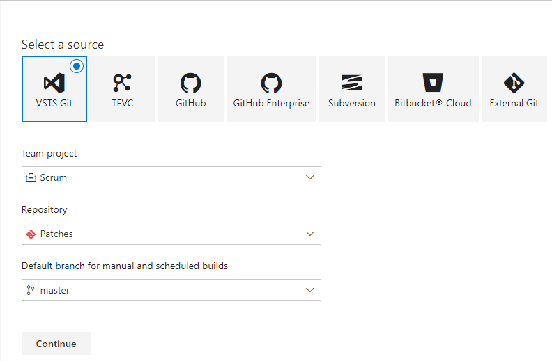
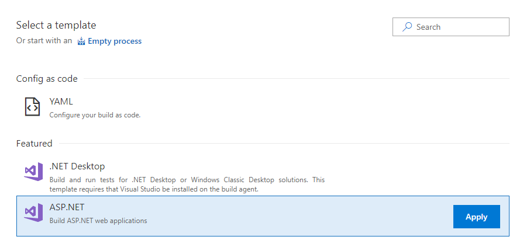
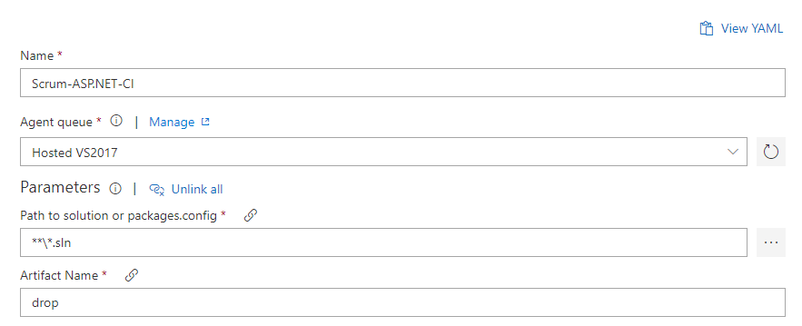
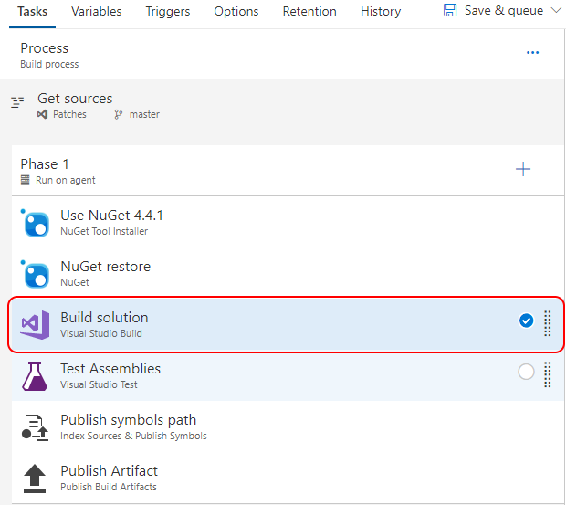
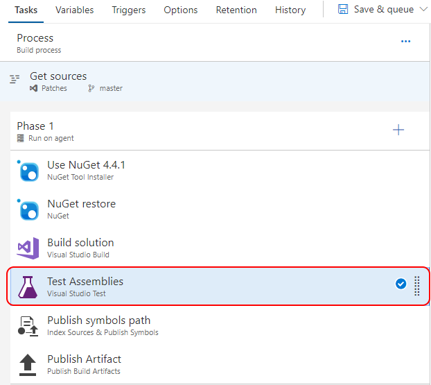
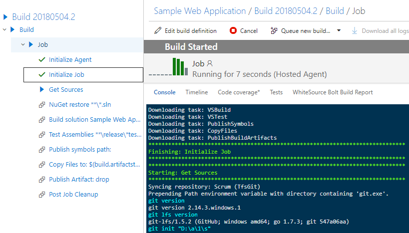
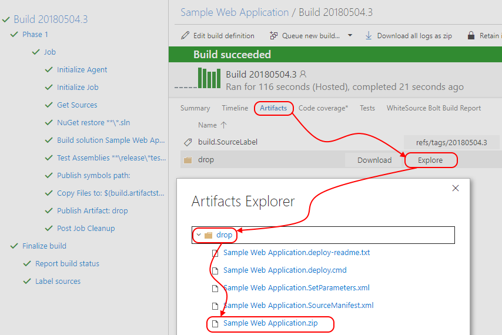

# Step By Step: Setup a CI Build #

## Create a Build Definition ##
1. Navigate to VSTS and select your project
[https://globaldevopsbootcamp.visualstudio.com](https://globaldevopsbootcamp.visualstudio.com)
2. Navigate to the "Build and Release" hub
3. Create a "New" definition

4. Configure the sources, select your correct team project, repository and branch. Then click "Continue".

5. Select a template, use "ASP.NET", click "Apply"

6. Specify / change your build name and select the private build agent that you have installed as agent queue
7. If your repository contains multiple solutions, select the specific solution

8. Select the Visual Studio Build step, notice the MSBuild Arguments, this will provide a published 

9. Select the "Test Assemblies" step, review the settings. Change the value for testassemblies from `**\$(BuildConfiguration)\*test*.dll`  to `**\$(BuildConfiguration)\*nunit.unittest*.dll`. This will only run the NUnit unit tests after the build.

## Enable Continuous Integration for your build ## 
1. While editing your build definition, navigate to the "Triggers" tab
2. Check the "Enable continuous integration" option

## Run the build ##
1. Press "Save & queue" to save and trigger the new build

2. Notice the feedback for the build being queued. Select the link to navigate to the build

3. VSTS Provides direct feedback from the build agent

4. After the build succeeds, refresh the browser
5. Notice the new "Artifacts" tab, and click it.

6. Select the "Explore" button behind the created artifact.
7. Expand the "Drop" folder
8. Check & Verify the desired output is part of the artifact. In this case a ".zip" file containing the application.

## Check that CI is triggered when a change to the code is pushed
1. Open the MVC Music Store solution in Visual Studio
1. Make a change to the web.config by adding a newline or a space in the file
1. Right click the web.config and click on Commit
1. Enter the required commit message and select Commit all and Push in the dropdown. This will push your change to the VSTS repo and trigger a new CI build.
1. Open VSTS in the browser
1. Click on the Build and Release tab
1. Click on Builds. You should see the build that you just triggered