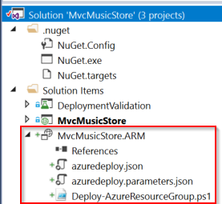
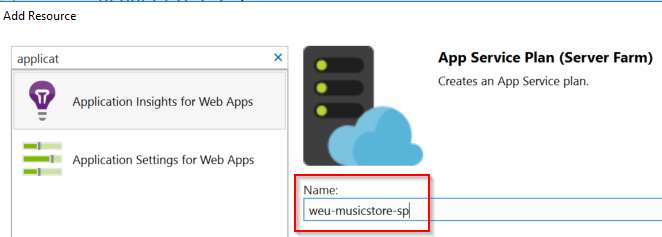
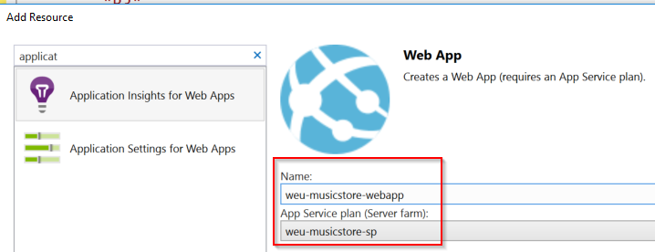
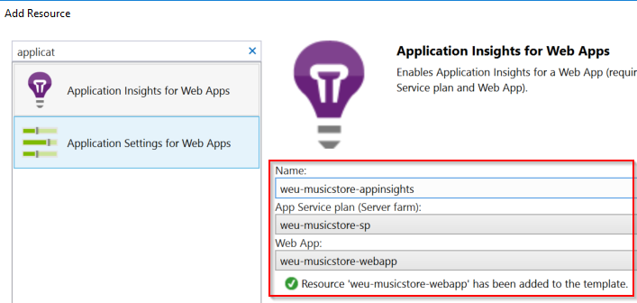
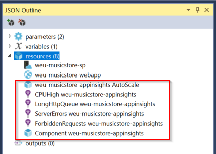
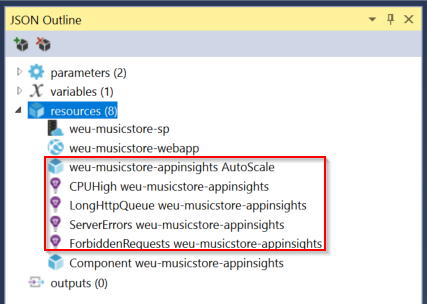

# Step By Step: Define ARM template for deployment #

**NB!** If you already have a Azure Resource Group project in your solution or ARM templates in one or another form, then customizing those based on details here would be the best approach. The description here is like it would be clean start.

1. Add a new project to your solution, of type _Azure Resource Group_, and place it under Solution Item folder, and call it e.g. _MvcMusicStore.ARM_

1. Select _Blank Template_ (skipped if you already have one)

1. The resulting project will look similar to below with 2 json files and a Deploy-AzureResourceGroup.ps1

   

1. Open **azuredeploy.json** and the **JSON Outline** tool (You can open it from _View -> Other Windows -> JSON Outline_)

1. Select resources, right click and add resource. Select Application Insights.

   

1. From the template you can see that its important to have a web app and service plan defined before creating an application insights. 
   - Create service plan (if you didn't have this) - enter name and press add.

   
   
   - Create web app (if you didn't have this) - enter name and press add. 

   

   - Create application insights - enter name and press add.
    
   

   - When you execute the template, it will predefine common threshold alerts and auto scaling based on thresholds. 

   

   - To Simplify, please delete the following resources from the template and only keep the 3 core ones. 

    

1. Please see the folling two files attached in the workitem. These files are modified and complet ARM templates with good practices applied.
   - azuredeploy.json
   - azuredeploy.parameters.json
   - We have a few common parameters that we need
   - We have created variables for resource names based on a naming convention
   - We have extracted instrumentation key as output parameter so we can use it in pipeline for the application

You can now execute the deployment of the ARM template manually if you would like by calling the following one by one:

```
Login-AzureRmAccount

$context = Get-AzureRmContext

Select-AzureRmSubscription -Name "SUBSCRIPTION NAME" -Context $context

# Validate that template is ok
.\Deploy-AzureResourceGroup.ps1 -ResourceGroupLocation westeurope -ResourceGroupName weu-musicstore-gdbc-rg -TemplateFile .\azuredeploy.json -TemplateParametersFile .\azuredeploy.parameters.json -ValidateOnly

# Run the deployment based on template and parameters file
.\Deploy-AzureResourceGroup.ps1 -ResourceGroupLocation westeurope -ResourceGroupName weu-musicstore-gdbc-rg -TemplateFile .\azuredeploy.json -TemplateParametersFile .\azuredeploy.parameters.json
```

1. **Important!** Make sure the naming convention / or resource names match your resource names in the resource group or it will create new resources instead of updating / finding that they exist 

## Commit & Change your build and release pipelines

1. Now commit the changes or added ARM template to version control. In my case they are located _/Provisioning/MvcMusicStore.ARM_.

1. Change your build to include those ARM template files also in the published artifact. 
e.g. You can use **Copy Files** task to copy these from _$(Build.SourcesDirectory)/Provisioning/MvcMusicStore.ARM/**_ into the _$(Build.ArtifactStagingDirectory)/ARM_ 

 

**NB!** Make sure the **Publish Artifact** task will include $(Build.ArtifactStagingDirectory)/ARM

1. Change your release and include the template deployment in the pipeline for environment. Make sure to add it before web application is deployed, so you can use the instrumentation key that is output by the arm template. 
The following steps in release pipeline are needed and in this order.

 

   - Your Azure Resource Group Deployment should be configured similar to the following:

 

   **TIP!** Use variables where you need to repeat the same value in multiple steps or they change between environments e.g. resource group name 

   -  **ARM Outputs** and **Tokenize in Zip archive** tasks you will find from VSTS marketplace, if its missing

   - Make sure you have changed your **ApplicationInsights.config** file to include token like below. The InstrumentationKey attribute could/should be different per environment. This enables multiple AI streams. No unwanted Debug / Test runs in your Production logging. 

   
