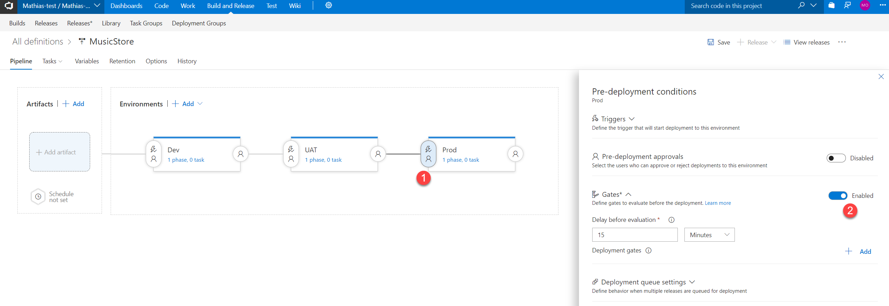
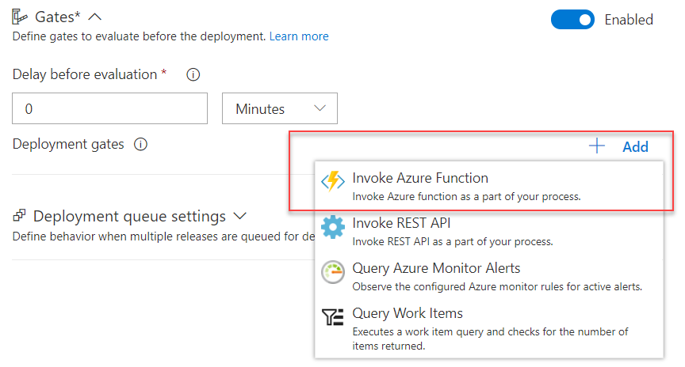
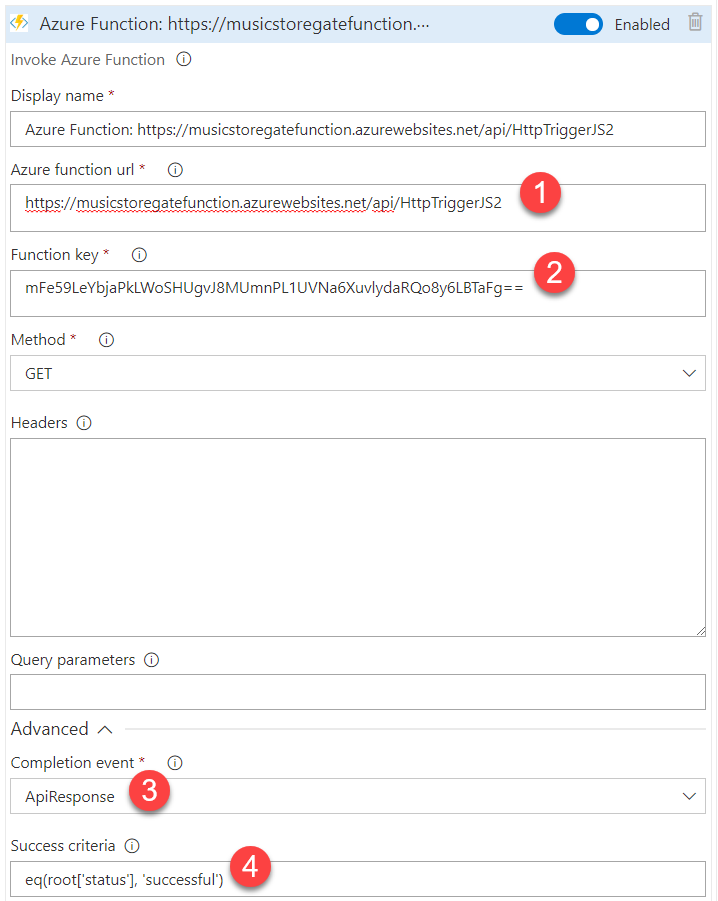
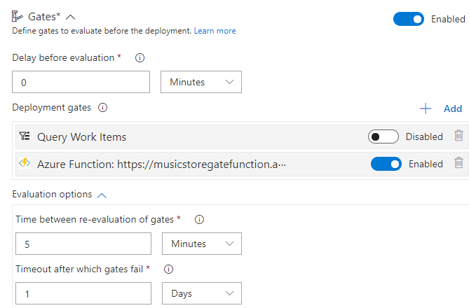
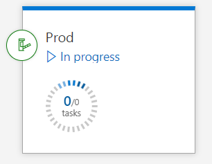

# Step by Step - Add a release gate that triggers the Azure function #

1. Navigate to the Build and Release hub in your VSTS project and select the Releases tab.

2. Open the pre-deployment conditions for the Prod environment and enable the Gates feature if it isn't already enabled from an earlier challenge.



3. Before we can configure the deployment gate we need some values for the Azure gate. Go to the function definition in the Azure portal. Select Get function URL.


4. Copy the function URL and paste it into notepad so that it's easy to copy the values (1, 2 and 3).


5. Add an Invoke Azure Function gate and configure it to use the Azure Function. 



6. Configure the gate with the parameters from the Azure function (1 and 2). Also set the completion event to ApiResponse and success criteria to the successful result from the function (3 and 4). The  criteria code snippet;

```
eq(root['status'],'successful')
```



7. Set Delay before evaluation to 0 and Time between re-evaluation of gates to 5 minutes.



8. Check that the Azure function now returns a failed result.

```javascript
module.exports = function (context, data) {
    context.log('Webhook was triggered!');

    // Fail gate
    context.res = {
        status: 400,
        body: { status: 'failed'}
    };

    // Pass gate
    // context.res = {
    //     body: { status: 'successful'}
    // };

    context.done();
}
```

9. Create a release and deploy to prod. Watch how it checks the Azure function and get an failed result back.


10. Update the Azure function to return a successful result

```javascript
module.exports = function (context, data) {
    context.log('Webhook was triggered!');

    // Fail gate
    //context.res = {
    //    status: 400,
    //    body: { status: 'failed'}
    //};

    // Pass gate
    context.res = {
        body: { status: 'successful'}
    };

    context.done();
}
```

11. Switch back to VSTS and watch how the gate will open when it gets a successful result back from the function and start the deployment to prod. 


